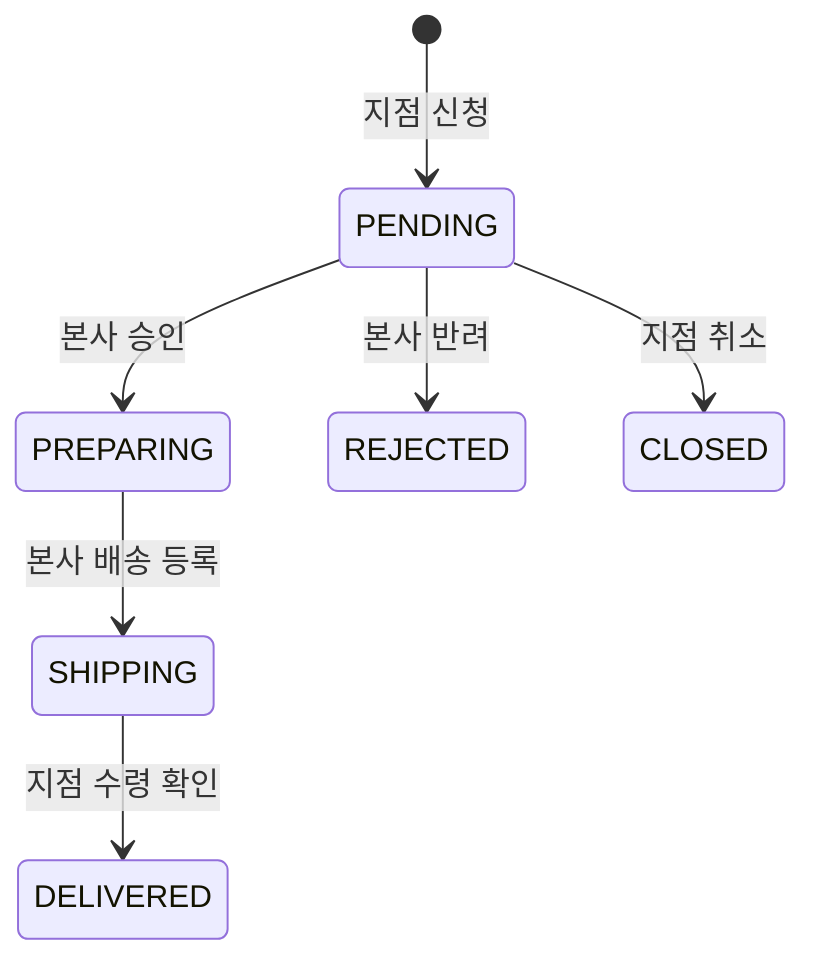

# 재고 신청 기능 리팩터링 학습 가이드

## 1. 문서 목적

이 문서는 `feature/stock-request` 브랜치의 기능을 바꾸지 않고, 다른 팀원이 코드의 흐름을 더 쉽게 따라갈 수 있도록 리팩터링한 이유와 원리를 설명한다.

분석 기준은 Notion의 [대우 정리](https://app.notion.com/p/2d24c00d157480a59395c20151599efa) 안에 있는 [학습노트](https://app.notion.com/p/3774c00d157480c3a578cc1e8701c06c) 전체이다.

- Java·웹·객체지향·JDBC·Git 기초: 30개
- Servlet·JSP·Spring MVC·SQL·MyBatis·JUnit: 39개
- REST·Spring Security·Vue·Docker·배포: 20개
- 분석한 하위 학습노트: 총 89개

학습노트에는 여러 기술이 나오지만, 현재 프로젝트는 Spring Data JPA를 사용한다. 따라서 MyBatis나 JdbcTemplate으로 기술을 교체하지 않고, 노트에서 반복된 **역할 분리와 기본 흐름**만 적용했다.

### 이 버전의 주석을 읽는 방법

재고신청과 직접 연결되는 백엔드, 프런트엔드, 테스트 코드에는 다음 기준으로 한국어 학습 주석을 추가했다.

- 클래스 위 주석: 이 파일이 전체 흐름에서 맡는 책임
- 필드와 의존성 위 주석: 해당 객체가 필요한 이유
- public 메서드 위 주석: 입력, 처리 순서, 반환값과 실패 조건
- private 메서드 위 주석: 긴 업무 흐름에서 분리된 한 단계의 목적
- 메서드 안 문단 주석: 권한·상태·트랜잭션·락·변환을 이 순서로 수행하는 이유
- 테스트 주석: 준비(Given), 실행(When), 검증(Then)과 확인하려는 업무 규칙
- Vue 주석: 화면 영역과 반응형 상태, 이벤트, API 호출 후 화면 갱신 순서

import, 단순 대입, 닫는 괄호처럼 코드 자체로 의미가 완전히 드러나는 줄에는 같은 말을 반복하지 않았다. 대신 하나의 목적을 가진 코드 문단 바로 위에 주석을 두어, **주석을 읽고 바로 아래 구현을 확인하는 방식**으로 학습할 수 있게 했다.

---

## 2. 먼저 이해할 전체 흐름

재고 신청 기능은 다음 순서로 동작한다.

```text
Vue 화면
  → API 함수
    → Controller
      → Service
        → Repository
          → DB
        ← Entity
      ← Response DTO
    ← JSON 응답
  ← 화면 갱신
```

각 계층의 책임은 다음과 같다.

| 계층 | 담당하는 일 | 담당하지 않는 일 |
|---|---|---|
| Controller | URL 연결, 요청 DTO 검증, Service 호출, HTTP 응답 | 재고 계산, 상태 변경, DB 조회 |
| Service | 권한 확인, 입력 검증, 상태 전이, 저장 순서, 트랜잭션 | 화면 표시, SQL 상세 구현 |
| Repository | Entity 조회·저장과 검색 쿼리 | 승인 가능 여부 같은 업무 판단 |
| Entity | 자신의 데이터와 상태 변경 기능 | HTTP 요청·응답 처리 |
| DTO | 요청과 응답에 필요한 데이터 전달 | DB 저장과 업무 처리 |
| Vue View | 입력, 로딩·오류·빈 화면, 사용자 이벤트 | 권한과 최종 업무 검증 |

이 구조를 유지하면 오류가 발생했을 때도 다음 순서로 확인할 수 있다.

```text
URL/HTTP 메서드
→ 요청 JSON
→ Controller DTO
→ Service 검증
→ Repository 조회
→ DB 상태
→ 응답 JSON
→ Vue 화면
```

---

## 3. 이번 리팩터링에서 지킨 조건

다음 외부 계약은 변경하지 않았다.

- API URL
- HTTP 메서드
- 요청·응답 JSON 필드
- 상태 코드와 기존 오류 메시지
- DB 테이블과 컬럼
- 재고 신청 상태 흐름
- 지점 관리자와 본사 관리자 권한
- 재고 수량과 재고 변동 이력 반영 방식

리팩터링은 **결과를 바꾸는 작업이 아니라, 같은 결과가 나오는 코드를 읽기 쉽게 정리하는 작업**이다.

---

## 4. 기본키와 신청번호를 구분해야 하는 이유

재고 신청에는 비슷해 보이지만 목적이 다른 두 값이 있다.

| 값 | 예시 | 역할 |
|---|---|---|
| `stockRequestId` | `50` | DB가 자동 생성하는 기본키. 조회·수정·승인·취소의 기준 |
| `requestNumber` | `REQ-20260714-50` | 사용자가 화면에서 확인하는 업무용 신청번호 |

기본키는 DB에서 한 행을 정확히 찾기 위한 값이다. 지점명, 맛 이름, 신청일은 중복될 수 있으므로 수정과 상태 변경의 기준으로 사용하면 안 된다.

현재 신청번호 생성 흐름은 다음과 같다.

```text
1. UUID를 사용한 임시 신청번호로 StockRequest 생성
2. stockRequestRepository.save(stockRequest)
3. DB가 stock_request_id 기본키 생성
4. REQ-날짜-기본키 형태의 최종 신청번호 생성
5. 트랜잭션 종료 시 JPA 더티체킹으로 변경된 신청번호 반영
```

코드에서는 이 과정이 `createStockRequest()`와 `assignRequestNumber()`라는 이름으로 드러나도록 정리했다.

```java
stockRequestRepository.save(stockRequest);

String requestNumber = "REQ-"
        + LocalDate.now().format(REQUEST_NUMBER_DATE_FORMAT)
        + "-"
        + stockRequest.getStockRequestId();
stockRequest.assignRequestNumber(requestNumber);
```

`count() + 1`로 기본키를 직접 만드는 방식은 동시에 두 요청이 들어오면 번호가 겹칠 수 있다. 따라서 기존의 DB 자동 증가 기본키 전략은 그대로 유지했다.

이 코드에서 `save()` 후 기본키를 바로 읽고, 다시 `save()`하지 않아도 신청번호가 반영되는 데는 전제가 있다. `createStockRequest()`가 `@Transactional` 안에서 실행되고, `save()`한 `stockRequest`가 JPA의 영속 상태이기 때문이다. 트랜잭션 밖의 객체나 준영속 객체는 필드만 바꾼다고 자동 저장되지 않는다.

임시 신청번호는 최초 INSERT의 `NOT NULL`, `UNIQUE`, `VARCHAR(30)` 제약을 통과하기 위한 값이다. 기존 `System.nanoTime()`은 여러 JVM 전체의 유일성을 보장하지 않으므로 UUID 기반 난수를 사용하되, 전체 UUID 36자에 `TMP-`를 붙이면 컬럼 길이를 넘는다는 점도 함께 고려했다. 하이픈을 제거한 UUID에서 26자리만 사용해 `TMP-`를 포함한 총 길이를 30자로 맞춘다. 이는 충돌 가능성이 매우 낮은 임시 값이며, 최종 신청번호의 고유성은 DB가 만든 기본키를 사용해 확보한다.

---

## 5. 수정 내용과 적용 원리

### 5.1 Controller의 공통 URL을 한 번만 작성

변경 전에는 모든 메서드가 전체 URL을 반복했다.

```java
@PostMapping("/api/branch/stock-requests")
@GetMapping("/api/branch/stock-requests")
@PatchMapping("/api/branch/stock-requests/{id}/cancel")
```

변경 후에는 클래스가 공통 경로를 담당하고 각 메서드는 자신의 동작만 표현한다.

```java
@RestController
@RequestMapping("/api/branch/stock-requests")
public class BranchStockRequestController {

    @PostMapping
    public StockRequestResponse createStockRequest(...) { ... }

    @PatchMapping("/{id}/cancel")
    public ResponseEntity<Void> cancelStockRequest(...) { ... }
}
```

실제 URL은 이전과 동일하다. 중복 문자열만 줄고 Controller의 구조가 더 잘 보인다.

### 5.2 이름만 보고 동작을 알 수 있도록 변경

`create`, `list`, `cancel`, `load`처럼 짧지만 범위가 모호한 이름을 기능이 드러나는 이름으로 변경했다.

| 변경 전 | 변경 후 |
|---|---|
| `create` | `createStockRequest` |
| `list` | `getStockRequests` |
| `cancel` | `cancelStockRequest` |
| `confirmReceipt` | `confirmStockReceipt` |
| Vue의 `load` | `loadStockRequests` |
| Vue의 `onApprove` | `approveRequest` |

클래스 이름과 메서드 이름을 함께 읽으면 `branchStockRequestService.createStockRequest(...)`처럼 의도가 바로 보인다.

### 5.3 긴 생성 메서드를 업무 순서대로 분리

기존 `create()`는 한 메서드에서 다음 작업을 모두 처리했다.

- 맛 ID 추출
- 중복 맛 확인
- 맛 데이터 조회
- 존재하지 않는 맛 확인
- 신청 헤더 생성
- 신청번호 생성
- 신청 품목 생성
- 응답 변환

변경 후 public 메서드는 업무 순서만 보여준다.

```java
public StockRequestResponse createStockRequest(Admin admin, StockRequestCreateRequest request) {
    Branch branch = ActorGuard.requireBranchOf(admin);
    List<Long> flavorIds = extractFlavorIds(request.items());

    validateNoDuplicateFlavors(flavorIds);
    Map<Long, Flavor> flavorsById = loadFlavors(flavorIds);

    LocalDateTime requestedAt = LocalDateTime.now();
    StockRequest stockRequest = saveNewStockRequest(admin, branch, request, requestedAt);
    List<StockRequestItem> items = createStockRequestItems(stockRequest, request.items(), flavorsById);

    return StockRequestResponse.from(stockRequest, items);
}
```

이 메서드만 읽어도 입력이 어떤 단계를 거쳐 저장되는지 알 수 있다. 상세 반복문과 객체 생성 코드는 이름 있는 private 메서드가 담당한다.

별도의 Validator, Factory, Manager 클래스를 만들지 않고 같은 Service 안의 private 메서드로만 분리한 이유는 현재 규모에서는 새 계층이 오히려 흐름을 숨기기 때문이다.

이 선택에는 절충도 있다. public 메서드는 짧고 순서가 잘 보이지만 private 메서드가 늘어 Service 파일의 전체 줄 수는 증가했다. 따라서 “메서드를 많이 나누면 항상 좋다”는 뜻이 아니다. 이번에는 초보자가 public 흐름부터 읽고 필요한 단계만 내려가 볼 수 있게 만드는 쪽을 선택했다.

### 5.4 복잡한 Stream 대신 기본 컬렉션과 반복문 사용

학습노트에는 Stream과 람다도 나오지만, 신청 생성처럼 순서가 중요한 코드는 기본 반복문이 더 쉽게 읽힐 수 있다.

```java
List<Long> flavorIds = new ArrayList<>();
for (StockRequestItemRequest itemRequest : itemRequests) {
    flavorIds.add(itemRequest.flavorId());
}
```

단순한 DTO 변환이나 그룹화처럼 Stream이 더 명확한 부분은 그대로 유지했다. 모든 코드를 무조건 반복문 또는 무조건 Stream으로 통일하지 않고, 읽기 쉬운 쪽을 선택했다.

### 5.5 Entity의 상태를 의미 있는 메서드로 변경

변경 전에는 Service가 Entity의 필드를 하나씩 직접 바꿨다.

```java
stockRequest.setRequestStatus(StockRequestStatus.REJECTED);
stockRequest.setRejectionReason(reason);
stockRequest.setProcessedAdmin(admin);
stockRequest.setProcessedAt(now);
```

변경 후에는 상태 변경의 의도가 메서드 이름으로 보인다.

```java
stockRequest.reject(admin, reason, now);
```

`StockRequest`에는 다음 기능이 생겼다.

- `assignRequestNumber()`
- `cancel()`
- `approve()`
- `reject()`
- `startShipping()`
- `confirmReceipt()`

`StockRequestItem`은 승인수량과 실제 수령에 사용할 수량을 스스로 계산한다.

```java
item.approveRequestedQuantity();
int receivedQuantity = item.getQuantityToReceive();
```

`BranchInventory`는 입고 수량을 더한 후 자신의 안전재고 기준으로 상태를 다시 결정한다.

```java
inventory.receive(receivedQuantity);
```

이것이 이번 코드에서 적용한 캡슐화의 범위다. 여러 필드를 외부에서 하나씩 바꾸지 않고, 의미 있는 객체 메서드로 한 번에 변경한다.

다만 **허용 상태를 검사하는 책임은 여전히 Service에 있다.** `StockRequest.approve()` 자체가 현재 상태를 확인하는 것은 아니며, Service의 `requireStatus()`가 먼저 실행된다는 전제다. `BranchInventory.receive()`도 양수 여부를 자체 검사하지 않고, 요청 DTO 검증과 승인수량을 신뢰한다. 이번 리팩터링에서는 규칙을 Entity와 Service 양쪽에 중복하지 않고 기존 Service 검증 방식을 유지했다.

### 5.6 공용 응답 DTO의 위치 정리

기존에는 본사 코드가 지점 패키지의 응답 DTO를 import했다.

```text
com.kiosk.branch.stockrequest.dto.StockRequestResponse
```

하지만 같은 응답은 지점과 본사가 모두 사용한다. 그래서 다음 공용 위치로 옮겼다.

```text
com.kiosk.stockrequest.dto.StockRequestResponse
com.kiosk.stockrequest.dto.StockRequestItemResponse
```

JSON 필드와 값은 바뀌지 않았다. 코드의 소유 위치만 실제 사용 범위와 맞췄다.

### 5.7 수령 확인 트랜잭션과 락 유지

수령 확인에는 세 가지 변경이 함께 일어난다.

```text
신청 상태를 DELIVERED로 변경
+ 지점 재고 수량과 상태 변경
+ inventory_transaction 이력 저장
```

셋은 함께 성공해야 하므로 기존 `@Transactional`을 유지했다. Spring 기본 규칙에서는 처리 중 런타임 예외가 발생해 트랜잭션이 롤백되면 세 변경이 함께 되돌아간다.

같은 신청을 동시에 두 번 처리하지 않도록 신청 행의 비관적 락 구현을 유지했다. 재고 행도 현재 수령 트랜잭션에서 쓰기 락으로 조회하며, 다른 모든 재고 변경 흐름도 같은 잠금 규칙을 사용할 때 동시 갱신 유실을 막을 수 있다.

```java
stockRequestRepository.findByIdForUpdate(stockRequestId);
branchInventoryRepository.findByBranchAndFlavorForUpdate(branchId, flavorId);
```

락은 코드가 조금 복잡해 보인다는 이유로 제거할 수 있는 중복 코드가 아니다. 다만 현재 단위 테스트는 락 메서드 사용과 결과만 확인하며, 두 요청을 실제 DB에 동시에 보내 락 동작 자체를 검증하는 통합 테스트는 아직 없다.

### 5.8 Vue의 반복 key와 공통 표시 함수 정리

재고 신청 품목 입력 행은 배열 순서인 `index` 대신 각 행의 `rowId`를 key로 사용하도록 변경했다.

```vue
<div v-for="(row, index) in rows" :key="row.rowId">
```

행을 삭제하면 index가 바뀔 수 있지만 `rowId`는 해당 행이 사라질 때까지 유지된다. 따라서 Vue가 기존 DOM 행을 다른 데이터로 잘못 재사용할 가능성을 줄인다.

지점과 본사 화면에 중복돼 있던 다음 표시 로직은 작은 공용 함수로 옮겼다.

- 첫 번째 맛과 나머지 품목 수 요약
- 승인수량 또는 신청수량 합계

```text
frontend/src/utils/stockRequestDisplay.js
```

API 호출, Pinia 저장소, 인증 구조는 새로 추가하지 않았다.

---

## 6. 상태 흐름 이해하기



각 변경 전에 Service가 현재 상태를 확인한다.

```java
requireStatus(
        stockRequest,
        StockRequestStatus.PENDING,
        "대기중인 신청만 승인할 수 있습니다"
);
```

상태는 문자열이 아니라 `StockRequestStatus` enum으로 비교한다. 오타를 줄이고 허용 상태를 코드에서 명확히 찾기 위해서다.

---

## 7. 테스트에서 확인한 내용

리팩터링 전 기준선은 다음과 같았다.

- 백엔드 테스트: 5개 성공
- 프론트엔드 production build 성공

기존 5개 테스트는 다음 동작을 이미 확인하고 있었다.

- 중복 맛 신청 거절
- 수령 시 재고 증가, 거래이력 저장, 안전재고 경계
- 승인 시 전체 신청수량 승인
- 본사 목록의 키워드 정규화
- Repository 검색 JPQL 로딩

이번 리팩터링에서는 다음 테스트를 새로 추가했다.

- 존재하지 않는 맛 신청 거절
- 다른 지점 신청 취소 거절
- 다른 지점 신청 수령 거절
- 대기 상태가 아닌 신청 취소 거절
- 배송중이 아닌 신청 수령 거절
- 지점 기능에 대한 본사 관리자 접근 거절
- 반려 시 반려 사유와 처리자 기록
- 배송 등록 정보 기록
- 대기 상태가 아닌 신청 승인 거절
- 대기 상태가 아닌 신청 반려 거절
- 배송 준비 상태가 아닌 신청 배송 등록 거절
- 본사 기능에 대한 지점 관리자 접근 거절
- 안전재고와 같은 수량은 `LOW`
- 안전재고보다 많은 수량은 `NORMAL`
- Entity의 승인·반려·배송·수령 메서드
- 임시 신청번호가 DB 컬럼 길이 30자를 넘지 않음

최종 검증 결과는 다음과 같다.

- 백엔드 테스트: 24개, 실패 0개
- 프론트엔드 `npm run build`: 성공
- `git diff --check`: 오류 없음

남아 있는 검증 한계도 있다.

- 실제 MySQL에서 동시 수령 요청을 발생시키는 락 테스트
- 처리 도중 두 번째 품목이 실패했을 때 전체 롤백되는 통합 테스트
- Controller URL·검증 오류·JSON 필드를 고정하는 MockMvc 테스트

현재 리팩터링 범위에서는 기존 API 계약과 단위 동작을 확인했고, 위 항목은 다음 통합 테스트 단계로 남겨두었다.

---

## 8. 일부러 추가하지 않은 것

학습노트를 모두 읽었지만 다음 항목은 현재 기능에 필요하지 않아 추가하지 않았다.

- `StockRequestService` 인터페이스와 단일 `ServiceImpl`
- 범용 `BaseController`, `BaseService`, `BaseRepository`
- State·Strategy·Factory 패턴
- CQRS, 이벤트 버스, 마이크로서비스
- MapStruct, QueryDSL
- 새 공통 응답 포맷
- 많은 수의 커스텀 예외 클래스
- JPA를 MyBatis로 재작성
- 새 JWT·세션·Pinia 인증 구조
- Docker와 DB 스키마 변경

기본기가 좋다는 것은 아는 기술을 많이 넣는 것이 아니라, 현재 문제를 해결하는 데 필요한 구조만 정확히 사용하는 것이다.

또한 `StockRequest`, `StockRequestItem`, `BranchInventory`의 범용 setter를 제거했기 때문에 다른 기능 브랜치를 이식할 때 기존 `setCurrentQuantity()` 같은 호출은 그대로 컴파일되지 않는다. 그 경우 setter를 다시 전부 열기보다 `decrease()`, `adjust()`, `receive()`처럼 실제 업무 의도가 드러나는 메서드로 바꿔 통합하는 것이 이 리팩터링의 방향과 맞다.

---

## 9. 변경 파일 안내

주석은 재고신청 흐름과 직접 연결되는 코드 43개 파일에 추가했다. 단순히 이번 리팩터링에서 내용이 바뀐 파일뿐 아니라, 처음 기능을 따라갈 때 함께 열어 보게 되는 API 모듈·요청 DTO·Repository·enum·모달·라우터도 포함했다.

### 백엔드 HTTP·업무 흐름

- `BranchStockRequestController.java`
- `BranchStockRequestService.java`
- `HqStockRequestController.java`
- `HqStockRequestService.java`
- `branch/stockrequest/dto/StockRequestCreateRequest.java`
- `branch/stockrequest/dto/StockRequestItemRequest.java`
- `hq/stockrequest/dto/RejectRequest.java`
- `hq/stockrequest/dto/ShipRequest.java`
- `hq/stockrequest/dto/StockRequestSummaryResponse.java`
- 지점·본사 `package-info.java`

### 도메인·영속성

- `StockRequest.java`
- `StockRequestItem.java`
- `StockRequestRepository.java`
- `StockRequestItemRepository.java`
- `StockRequestStatus.java`
- `RequestType.java`
- `Urgency.java`
- `BranchInventory.java`
- `BranchInventoryRepository.java`
- `InventoryStatus.java`
- `InventoryTransaction.java`
- `InventoryTransactionRepository.java`
- `InventoryTransactionType.java`

### 공용 응답 DTO

- `com/kiosk/stockrequest/dto/StockRequestResponse.java`
- `com/kiosk/stockrequest/dto/StockRequestItemResponse.java`

### 프론트엔드

- `router/index.js`
- `BranchLayout.vue`
- `HqLayout.vue`
- `InventoryView.vue`
- `StockRequestFormModal.vue`
- `StockRequestStatusView.vue`
- `StockRequestListView.vue`
- `RejectModal.vue`
- `ShipModal.vue`
- `branchStockRequest.js`
- `hqStockRequest.js`
- `stockRequestDisplay.js`

### 테스트

- `BranchStockRequestServiceTest.java`
- `HqStockRequestServiceTest.java`
- `StockRequestTest.java`
- `StockRequestRepositoryTest.java`
- `BranchInventoryTest.java`

---

## 10. 코드를 읽는 추천 순서

처음부터 모든 파일을 동시에 읽지 말고 다음 여섯 묶음으로 나누어 읽는다. 처음에는 CSS와 모든 private 메서드까지 파고들지 않고 큰 흐름부터 확인한다.

### 10.1 첫 번째 묶음: 전체 구조와 데이터 형태

```text
이 학습 가이드
→ StockRequestStatus.java
→ StockRequestCreateRequest.java
→ StockRequestResponse.java
```

이 묶음에서는 다음 내용만 먼저 이해한다.

- 신청 상태에는 무엇이 있는가
- 화면이 어떤 JSON을 보내는가
- 서버가 어떤 JSON을 반환하는가
- DB 기본키 `stockRequestId`와 화면용 `requestNumber`는 어떻게 다른가

### 10.2 두 번째 묶음: 지점의 재고 신청 생성

```text
InventoryView.vue
→ StockRequestFormModal.vue
→ branchStockRequest.js의 createStockRequest()
→ BranchStockRequestController.createStockRequest()
→ BranchStockRequestService.createStockRequest()
```

Service에서는 public 메서드의 큰 순서를 먼저 읽는다.

```text
현재 지점 확인
→ 맛 ID 추출
→ 중복 검사
→ 실제 맛 조회
→ 신청서 저장
→ 신청 품목 저장
→ 응답 DTO 변환
```

이 순서가 이해된 다음에 `extractFlavorIds()`, `validateNoDuplicateFlavors()`, `loadFlavors()` 같은 private 메서드로 내려간다.

### 10.3 세 번째 묶음: 본사의 승인·반려·배송 처리

```text
StockRequestListView.vue
→ RejectModal.vue 또는 ShipModal.vue
→ hqStockRequest.js
→ HqStockRequestController.java
→ HqStockRequestService.java
```

다음 상태 흐름을 중심으로 읽는다.

```text
PENDING
├─ 승인 → PREPARING
└─ 반려 → REJECTED

PREPARING
└─ 배송 등록 → SHIPPING
```

Service 메서드는 다음 순서로 읽는다.

```text
approveStockRequest()
→ rejectStockRequest()
→ shipStockRequest()
```

### 10.4 네 번째 묶음: 지점의 취소와 입고 확정

```text
StockRequestStatusView.vue
→ branchStockRequest.js
→ BranchStockRequestController.java
→ BranchStockRequestService.java
```

먼저 `cancelStockRequest()`와 `confirmStockReceipt()`를 읽는다. 입고 확정은 다음 처리들이 하나의 트랜잭션 안에서 이어진다.

```text
신청 행 잠금
→ SHIPPING 상태 확인
→ 품목 조회
→ 지점 재고 행 잠금
→ 현재고 증가
→ 재고 상태 재계산
→ 입출고 이력 저장
→ 신청을 DELIVERED로 변경
```

### 10.5 다섯 번째 묶음: Entity와 DB 저장 원리

```text
StockRequest.java
→ StockRequestItem.java
→ BranchInventory.java
→ InventoryTransaction.java
```

처음부터 모든 필드를 외우지 말고 의미 있는 상태 변경 메서드를 먼저 확인한다.

```text
StockRequest.cancel()
StockRequest.approve()
StockRequest.reject()
StockRequest.startShipping()
StockRequest.confirmReceipt()

StockRequestItem.approveRequestedQuantity()
BranchInventory.receive()
```

그다음 Repository에서 다음 개념을 확인한다.

- 메서드 이름으로 만드는 기본 조회
- `JOIN FETCH`와 N+1 조회 문제
- `findByIdForUpdate()`의 비관적 잠금
- 트랜잭션 안의 JPA 변경 감지로 `UPDATE`되는 과정

### 10.6 여섯 번째 묶음: 테스트로 이해 확인

```text
StockRequestTest.java
→ BranchInventoryTest.java
→ BranchStockRequestServiceTest.java
→ HqStockRequestServiceTest.java
→ StockRequestRepositoryTest.java
```

테스트 하나를 읽을 때는 다음 세 부분을 구분한다.

```text
Given: 어떤 상태의 객체를 준비했는가
When: 어떤 메서드를 호출했는가
Then: 상태와 값이 어떻게 바뀌어야 하는가
```

### 10.7 최종 추천 순서

```text
전체 구조와 DTO
→ 지점 신청 생성
→ 본사 승인·반려
→ 본사 배송 등록
→ 지점 입고 확정
→ Entity 상태 변경
→ Repository와 잠금
→ 같은 이름의 테스트
```

한 기능을 추적할 때는 항상 다음 방향을 유지한다.

```text
Vue 화면
→ API 함수
→ Controller
→ Service public 메서드
→ 필요한 private 메서드
→ Entity와 Repository
→ 같은 기능의 테스트
```

이 방향이 보이면 재고 신청 기능의 입력, 검증, 상태 변경, DB 반영, 응답까지 한 줄로 설명할 수 있다.
